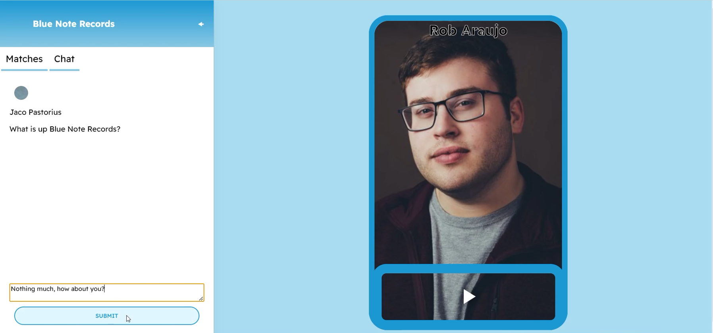

# Song Central: Reach for the Sky.

This app is designed to connect artists and record labels by showcasing a song from each party. Similar to Tinder, if both parties swipe right on the other parties sample, then they are matched and able to chat and make deals with each other!

## Running the App

#### Prerequisites
* Node.js

#### Set-up
1. Open two terminals, one navigated to the folder `client`, the other navigated to `server`.
2. Run `npm install` in both terminals.
3. Run `npm run start:frontend` for the `client`, and `npm run start:backend` for the `server`. 

## Demo
https://youtu.be/oJkyrHbaimA

## Stack 
* Frontend
  * React
  * Typescript

* Server-side
  * Node.js
  * Express.js
* Backend
  * MongoDB
* npm packages / misc.
  * react-cookie
  * react-tinder-card
  * react-player  
  * jsonwebtoken
  * bcrypt

